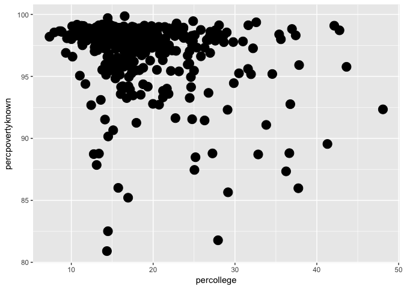
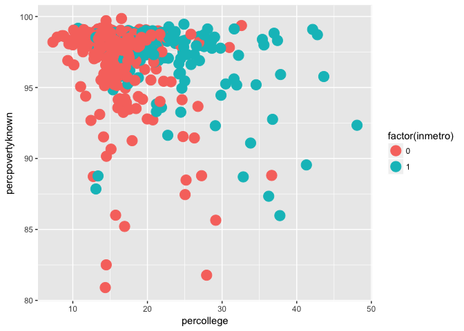
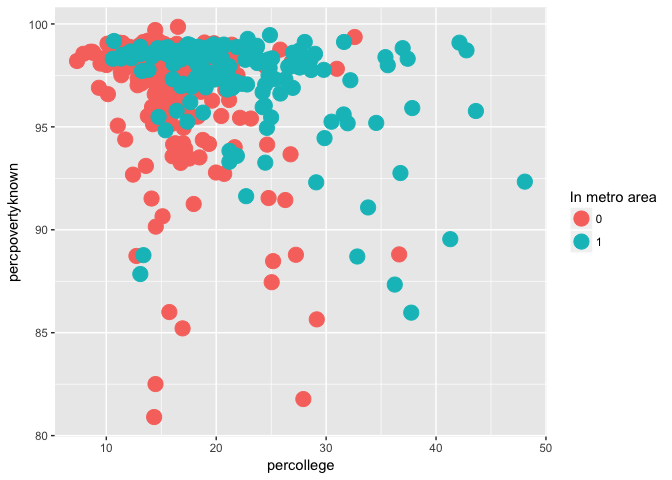

Order of Layers in R ggplot2
================

Given that most tutorials online do not address the issue of controlling the order of layers in ggplot2 clearly, this document aims to provide thoughts regarding it.
First, install the plotting package ggplot2 (if it has not been done yet) and load this package. To get most recent version of ggplot2, using most recent version of R is recommended.

``` r
#install.packages("ggplot2")
library(ggplot2)
```

Then, take a look at the dataset that will be used in this tutorial, midwest. This is a built-in dataset in ggplot2, so no other installations are required.

``` r
head(midwest)
```

    ## # A tibble: 6 x 28
    ##     PID county    state   area poptotal popdensity popwhite popblack
    ##   <int> <chr>     <chr>  <dbl>    <int>      <dbl>    <int>    <int>
    ## 1   561 ADAMS     IL    0.0520    66090       1271    63917     1702
    ## 2   562 ALEXANDER IL    0.0140    10626        759     7054     3496
    ## 3   563 BOND      IL    0.0220    14991        681    14477      429
    ## 4   564 BOONE     IL    0.0170    30806       1812    29344      127
    ## 5   565 BROWN     IL    0.0180     5836        324     5264      547
    ## 6   566 BUREAU    IL    0.0500    35688        714    35157       50
    ## # ... with 20 more variables: popamerindian <int>, popasian <int>,
    ## #   popother <int>, percwhite <dbl>, percblack <dbl>, percamerindan <dbl>,
    ## #   percasian <dbl>, percother <dbl>, popadults <int>, perchsd <dbl>,
    ## #   percollege <dbl>, percprof <dbl>, poppovertyknown <int>,
    ## #   percpovertyknown <dbl>, percbelowpoverty <dbl>,
    ## #   percchildbelowpovert <dbl>, percadultpoverty <dbl>,
    ## #   percelderlypoverty <dbl>, inmetro <int>, category <chr>

Basically, it is a data frame with 437 rows and 28 variables that contains demographic information of midwest counties. For explanations of each column in this dataset, please refer to this webpage: <http://ggplot2.tidyverse.org/reference/midwest.html>
Now the question is to ask the relationship between percollege (Percent college educated) and percpovertyknown (Percent poverty known). We can easily draw a scatter plot using geom\_point( ) command in ggplot2 (point size is set to 5).

``` r
ggplot(midwest, aes(percollege, percpovertyknown)) + geom_point(size = 5)
```



Next, we want to see whether being located in metropolitan area can affect counties' education and poverty percentage. In this case, we can draw the same scatter plot and group all points by the column inmetro (In a metro area) using different colours. Note that there are only two possible values (0 and 1) for this variable. Let's change the its class factor, in case ggplot2 may view it as a continuous variable.

``` r
ggplot(midwest, aes(percollege, percpovertyknown, colour = factor(inmetro))) + geom_point(size = 5)
```



Then we can notice that some green points are blocked by red points in certain areas since they are so closed to each other. ggplot2 actually plotted those points in an order of going from the first row to the last row. If we want to bring green points to front, there are at least two ways to do it.

### Method 1: Plot Two Layers Separately

In this method, first we need to divide the whole dataframe into two smaller dataframes according to the variable inmetro.

``` r
layer_1 <- midwest[midwest$inmetro == "0", ]
layer_2 <- midwest[midwest$inmetro == "1", ]
```

Then, we can plot these two dataframes as two layers. use + geom\_point( ) to add layers of point plots. Note that we don't put any arguments in the function ggplot( ) as it controls the global aesthetics. For controling colour, we can manualy set the color by typing in the colour code (in this case red is \#F8766D, and green is \#00BFC4) and use scale\_colour\_manual( ) function. As we aim to bring green points (points with inmetro values of 1s) to front, we plot Os first followed by 1s. The scale\_colour\_manual( ) function also allows users to define legend name and labels.

``` r
ggplot() + geom_point(data = layer_1, aes(percollege, percpovertyknown, colour = "red"), size = 5)+
  geom_point(data = layer_2, aes(percollege, percpovertyknown, colour = "green"), size = 5)+
  scale_color_manual(name = "In metro area", values = c("red" = "#F8766D", "green"="#00BFC4"), labels = c("red" = "0", "green" ="1"))
```


### Method 2: Plot using the sorted dataframe

In this method, we first sort the dataframe by moving samples with inmetro = 0 to the top of the list, which will be plotted first followed by all points with inmetro = 1. In this case, we can make the plot based on the whole dataframe without divding it.

``` r
order_inmetro<-c("0", "1") #define the order
midwest_sorted<-midwest[order(match(midwest$inmetro, order_inmetro)),] # sort the rows of dataframe
midwest_sorted$inmetro<-as.character(midwest_sorted$inmetro) # convert the class of inmetro variable to character
ggplot(data = midwest_sorted, aes(percollege, percpovertyknown, colour = inmetro)) + geom_point(size = 5)+
  scale_color_manual(name = "In metro area", values = c("0" = "#F8766D", "1"="#00BFC4"), labels = c("0" = "0", "1" ="1"))
```



Notice: Please note that the value and label arguments taken by scale\_color\_manual( ) function are named vectors, which can also be defined outside of the plotting sector. For example,

``` r
colour_values <- c("0" = "#F8766D", "1"="#00BFC4") 
print(colour_values)
```

    ##         0         1 
    ## "#F8766D" "#00BFC4"

``` r
#is equivalent to 
colour_values <- c("#F8766D", "#00BFC4")
names(colour_values) <- c("0", "1")
print(colour_values)
```

    ##         0         1 
    ## "#F8766D" "#00BFC4"
